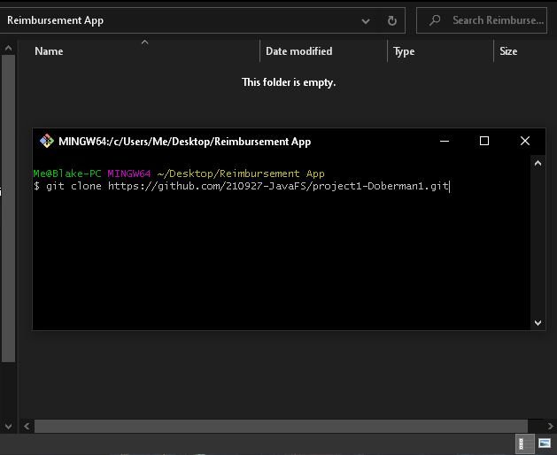
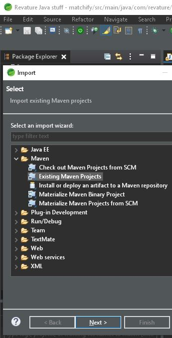
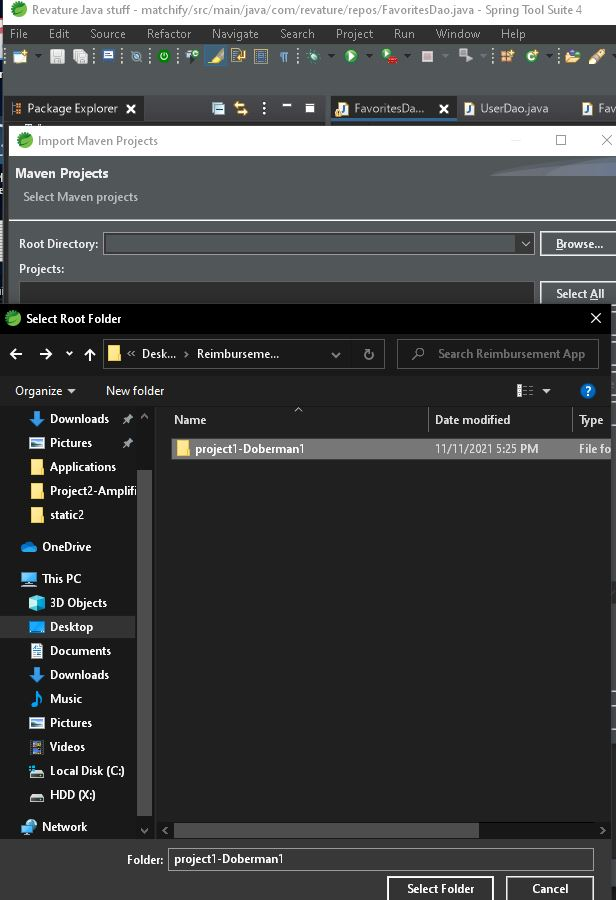
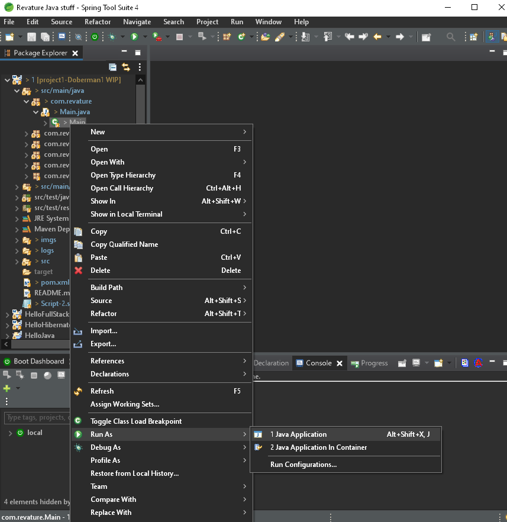
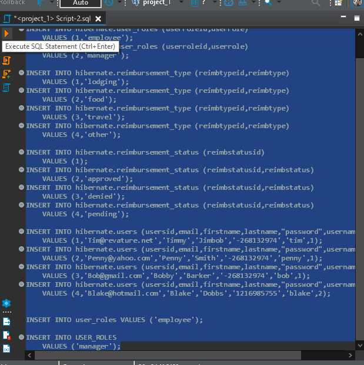
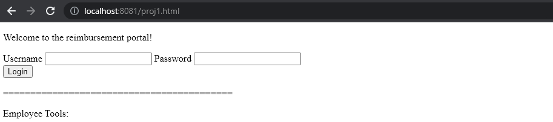
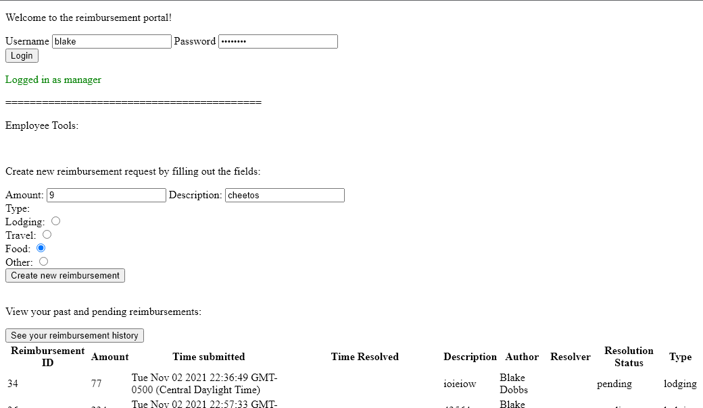

# Employee Reimbursement System (ERS)

## Project Description
The Expense Reimbursement System (ERS) will manage the process of reimbursing employees for expenses incurred while on company time. All employees in the company can login and submit requests for reimbursement and view their past tickets and pending requests. Finance managers can log in and view all reimbursement requests and past history for all employees in the company. Finance managers are authorized to approve and deny requests for expense reimbursement.

## Technologies Used:  
  Java, 
  SQL, 
  CSS, 
  HTML, 
  JavaScript, 
  JUnit, 
  Hibernate, 
  AWS RDS, 
  Log4J, 
  Javalin

## Features:  
  Login  
  Two account types with different access to features  
  All employees can submit reimbursement requests  
  All employees can view their past and pending reimbursements  
  Finance managers can view all reimbursement requests  
  Managers can approve or deny requests  

**Possible future developement features:**  
Multiple pages/ routing to hide inaccessbile functionality  
Prettier user interace

## Setting up the application:

**Clone the repository onto your computer**

**Import an existing Maven project into your IDE**

**Select the folder into which you cloned the repository**

**Run the Main class as a java application**

**Run the PostgreSQL script in a database instance**

**Head to a browser and navigate to http://localhost:8081/proj1.html**

## Usage

To use any features, simply follow the displayed instructions! Just make sure to login first. A sample manager has a username of "blake" and password of "password". A sample employee has a username of "tim" and password of "revature". Thanks for checking out my reimbursement project!  
**Sample:**

